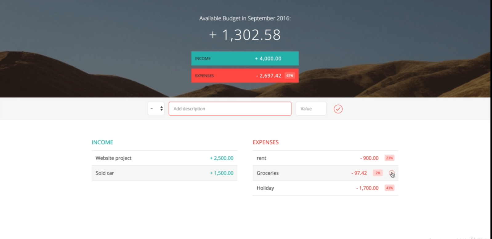
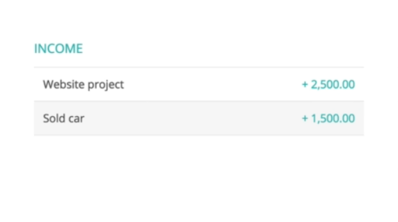
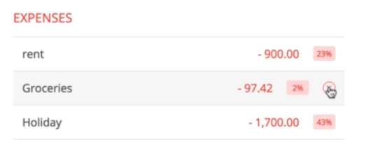

# Budgety
### Budget calculator application.
#### Features: 
###### 1. User can log all their incomes and expenses to have a clear vision about their overall budget.

<hr />

###### 2. User can delete the input from the expense or income field, all the calculation will manually taken care off.

<hr />

###### 3. We also calculates the percentage of each expense w.r.t. overall income.

<hr />

###### If you wish to add any another feautre to it, feel free to download the project and contribute.
###### In the root directory.
```
npm install

npm start
```
